# **What makes a man?**
### *Final Project for Introduction to Data Science at the University of Maryland, College Park*
#### **Authors:** Nate Dudley, Tsipora Stone, and Alan Kossoy

### **Introduction**

In 2006, Tarana Burke first coined the phrase "Me Too" to help women who had survived sexual assault or violence of any kind. For 10 years after, this phrase became an instant sensation for all people who wished to report a sexual assault encounter. In October, 2017, the #MeToo hashtag went viral on Twitter, with millions of users using this hashtag. After this movement, many men began to question their actions as men and what "masculinity" really entailed. To learn more about the #MeToo movement, go to [www.nytimes.com/series/metoo-moment](https://www.nytimes.com/series/metoo-moment)

In order to discover how men truly felt about their masculinity in the wake of the "#MeToo" movement, FiveThirtyEight created a survey in partnership with SurveyMonkey and WNYC Studios in which they polled 1,615 men above the age of 18 for two weeks in May 2018 on how masculine they feel and their lifestyle choices, asking questions such as how often do you cry. The motivation for this project came from this [article](https://fivethirtyeight.com/features/what-do-men-think-it-means-to-be-a-man/) and the csv file with the data resulting from this survey can be found [here](https://www.kaggle.com/fivethirtyeight/fivethirtyeight-masculinity-survey-dataset/version/96#README.md).

In this project, we want to explore what factors are considered masculine in today's society and how men view these attributes. 

### **Data Collection**

We imported the pandas library to curate the data from the csv file (more information about Pandas can be found [here](https://pandas.pydata.org/). In order to do analysis on the data, read in the csv file and store it in a pandas dataframe. We did not have to preprocess the data because it was already formatted nicely in a csv file. The dataframe has columns which include:

**start date, end date, 36 questions from the survey, race and ethnicity, education, age, amount of kids, sexual orientation**


```python
import pandas as pd
import matplotlib.pyplot as plot

raw_data = pd.read_csv("data/fivethirtyeight-masculinity-survey-dataset/raw-responses.csv")

raw_data.head(5)
```


<div>
<style scoped>
    .dataframe tbody tr th:only-of-type {
        vertical-align: middle;
    }

    .dataframe tbody tr th {
        vertical-align: top;
    }

    .dataframe thead th {
        text-align: right;
    }
</style>
<table border="1" class="dataframe">
  <thead>
    <tr style="text-align: right;">
      <th></th>
      <th>Unnamed: 0</th>
      <th>StartDate</th>
      <th>EndDate</th>
      <th>q0001</th>
      <th>q0002</th>
      <th>q0004_0001</th>
      <th>q0004_0002</th>
      <th>q0004_0003</th>
      <th>q0004_0004</th>
      <th>q0004_0005</th>
      <th>...</th>
      <th>q0035</th>
      <th>q0036</th>
      <th>race2</th>
      <th>racethn4</th>
      <th>educ3</th>
      <th>educ4</th>
      <th>age3</th>
      <th>kids</th>
      <th>orientation</th>
      <th>weight</th>
    </tr>
  </thead>
  <tbody>
    <tr>
      <th>0</th>
      <td>1</td>
      <td>5/10/18 4:01</td>
      <td>5/10/18 4:06</td>
      <td>Somewhat masculine</td>
      <td>Somewhat important</td>
      <td>Not selected</td>
      <td>Not selected</td>
      <td>Not selected</td>
      <td>Pop culture</td>
      <td>Not selected</td>
      <td>...</td>
      <td>Middle Atlantic</td>
      <td>Windows Desktop / Laptop</td>
      <td>Non-white</td>
      <td>Hispanic</td>
      <td>College or more</td>
      <td>College or more</td>
      <td>35 - 64</td>
      <td>No children</td>
      <td>Gay/Bisexual</td>
      <td>1.714026</td>
    </tr>
    <tr>
      <th>1</th>
      <td>2</td>
      <td>5/10/18 6:30</td>
      <td>5/10/18 6:53</td>
      <td>Somewhat masculine</td>
      <td>Somewhat important</td>
      <td>Father or father figure(s)</td>
      <td>Not selected</td>
      <td>Not selected</td>
      <td>Not selected</td>
      <td>Not selected</td>
      <td>...</td>
      <td>East North Central</td>
      <td>iOS Phone / Tablet</td>
      <td>White</td>
      <td>White</td>
      <td>Some college</td>
      <td>Some college</td>
      <td>65 and up</td>
      <td>Has children</td>
      <td>Straight</td>
      <td>1.247120</td>
    </tr>
    <tr>
      <th>2</th>
      <td>3</td>
      <td>5/10/18 7:02</td>
      <td>5/10/18 7:09</td>
      <td>Very masculine</td>
      <td>Not too important</td>
      <td>Father or father figure(s)</td>
      <td>Not selected</td>
      <td>Not selected</td>
      <td>Not selected</td>
      <td>Not selected</td>
      <td>...</td>
      <td>East North Central</td>
      <td>Windows Desktop / Laptop</td>
      <td>White</td>
      <td>White</td>
      <td>College or more</td>
      <td>College or more</td>
      <td>35 - 64</td>
      <td>Has children</td>
      <td>Straight</td>
      <td>0.515746</td>
    </tr>
    <tr>
      <th>3</th>
      <td>4</td>
      <td>5/10/18 7:27</td>
      <td>5/10/18 7:31</td>
      <td>Very masculine</td>
      <td>Not too important</td>
      <td>Father or father figure(s)</td>
      <td>Mother or mother figure(s)</td>
      <td>Other family members</td>
      <td>Not selected</td>
      <td>Not selected</td>
      <td>...</td>
      <td>East North Central</td>
      <td>Windows Desktop / Laptop</td>
      <td>White</td>
      <td>White</td>
      <td>Some college</td>
      <td>Some college</td>
      <td>65 and up</td>
      <td>Has children</td>
      <td>No answer</td>
      <td>0.600640</td>
    </tr>
    <tr>
      <th>4</th>
      <td>5</td>
      <td>5/10/18 7:35</td>
      <td>5/10/18 7:42</td>
      <td>Very masculine</td>
      <td>Very important</td>
      <td>Not selected</td>
      <td>Not selected</td>
      <td>Other family members</td>
      <td>Not selected</td>
      <td>Not selected</td>
      <td>...</td>
      <td>East North Central</td>
      <td>Windows Desktop / Laptop</td>
      <td>White</td>
      <td>White</td>
      <td>College or more</td>
      <td>College or more</td>
      <td>35 - 64</td>
      <td>No children</td>
      <td>Straight</td>
      <td>1.033400</td>
    </tr>
  </tbody>
</table>
<p>5 rows × 98 columns</p>
</div>


### **Exploratory Data Analysis**

In this section of analysis, we are looking for correlations between the questions asked in the survey and people's perceived masculinity levels. In order to achieve this, we create a series of graphs showing correlation and compute the correlation coefficients and then run a decision tree and regression model on test data to see if we can predict how masculine people feel based on their answers to certain questions.

#### Masculinity vs. Importance Plot
In this first plot we wanted to see how many people considered themselves "very masculine", "somewhat masculine", "not very masculine", "not at all masculine" and those that gave no answer. This gives us a general idea of what men think of themselves in terms of their own masculinity. 


```python
x = raw_data['q0001'].value_counts()
keys = list(x.keys())
keys.insert(0, keys.pop(1))

print(keys)

plot.figure(figsize = (20, 10))
plot.bar(keys, [x[k] for k in keys])
plot.xlabel('Reported Masculinity')
plot.ylabel('Number of Respondents')
plot.title('Self Reported Masculinity Distribution (Q1)')
plot.show()
```

    ['Very masculine', 'Somewhat masculine', 'Not very masculine', 'Not at all masculine', 'No answer']


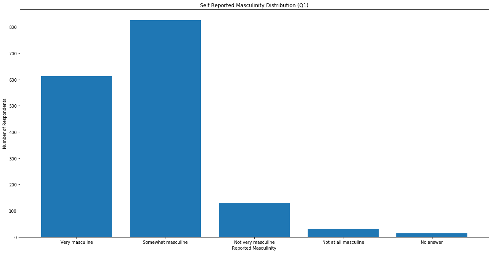


**Results:** From this graph, it is evident that most men who took this survey believe that they are somewhat masculine, with approximately 800 men giving this answer, while the second most popular category was very masculine with approximately 600 men giving this answer. This data shows that most men consider themselves on the higher end of the masculinity scale.

### **Tidying the Data**

In order to do further analysis on the data and to find the correlations between the certain questions asked in the survey, we needed to tidy our data into a numerical or boolean type. For questions 1, 2, and all parts of 7, we assigned an integer corresponding to the scaled strength of the option given. For example, Question 7 would range from 'Never, and not open to it' to 'Often' thus would assign those values of 1 to 5 respectively and None to 'No answer', as not to contribute those terms to regression or classification by dropping rows that contain them. For all parts of questions 8 and 20, we tidied the data by giving "not selected" False values and everything else True values.


```python
q1_answers = list(raw_data['q0001'].unique())
q1_answers.insert(0, q1_answers.pop(1))
q1_answers.insert(2, q1_answers.pop(3))
q1_answers.reverse()
q2_answers = list(raw_data['q0002'].unique())
q2_answers.insert(0, q2_answers.pop(2))
q2_answers.reverse()
q7_answers = list(raw_data['q0007_0001'].unique())
q7_answers.insert(1, q7_answers.pop(2))
q7_answers.reverse()

scrub_data = raw_data.copy()

for index1, row in raw_data.iterrows():
    if row['q0001'] != 'No answer':
        scrub_data.loc[index1, 'q0001'] = int(q1_answers.index(row['q0001'])) 
    else:
        scrub_data.loc[index1, 'q0001'] = None
    if row['q0002'] != 'No answer':
        scrub_data.loc[index1, 'q0002'] = int(q2_answers.index(row['q0002'])) 
    else:
        scrub_data.loc[index1, 'q0002'] = None
    for index2, val in row['q0007_0001':'q0007_0011'].iteritems():
        if val != 'No answer':
            scrub_data.loc[index1, index2] = int(q7_answers.index(val))
        else:
            scrub_data.loc[index1, index2] = None
    for index2, val in row['q0008_0001':'q0008_0012'].iteritems():
        if val == 'Not selected':
            scrub_data.loc[index1, index2] = False
        else:
            scrub_data.loc[index1, index2] = True
    for index2, val in row['q0020_0001':'q0020_0006'].iteritems():
        if val == 'Not selected':
            scrub_data.loc[index1, index2] = False
        else:
            scrub_data.loc[index1, index2] = True

q1_answers = pd.Series(q1_answers)
q2_answers = pd.Series(q2_answers)
q7_answers = pd.Series(q7_answers)

scrub_data.head(5)
```


<div>
<style scoped>
    .dataframe tbody tr th:only-of-type {
        vertical-align: middle;
    }

    .dataframe tbody tr th {
        vertical-align: top;
    }

    .dataframe thead th {
        text-align: right;
    }
</style>
<table border="1" class="dataframe">
  <thead>
    <tr style="text-align: right;">
      <th></th>
      <th>Unnamed: 0</th>
      <th>StartDate</th>
      <th>EndDate</th>
      <th>q0001</th>
      <th>q0002</th>
      <th>q0004_0001</th>
      <th>q0004_0002</th>
      <th>q0004_0003</th>
      <th>q0004_0004</th>
      <th>q0004_0005</th>
      <th>...</th>
      <th>q0035</th>
      <th>q0036</th>
      <th>race2</th>
      <th>racethn4</th>
      <th>educ3</th>
      <th>educ4</th>
      <th>age3</th>
      <th>kids</th>
      <th>orientation</th>
      <th>weight</th>
    </tr>
  </thead>
  <tbody>
    <tr>
      <th>0</th>
      <td>1</td>
      <td>5/10/18 4:01</td>
      <td>5/10/18 4:06</td>
      <td>3</td>
      <td>3</td>
      <td>Not selected</td>
      <td>Not selected</td>
      <td>Not selected</td>
      <td>Pop culture</td>
      <td>Not selected</td>
      <td>...</td>
      <td>Middle Atlantic</td>
      <td>Windows Desktop / Laptop</td>
      <td>Non-white</td>
      <td>Hispanic</td>
      <td>College or more</td>
      <td>College or more</td>
      <td>35 - 64</td>
      <td>No children</td>
      <td>Gay/Bisexual</td>
      <td>1.714026</td>
    </tr>
    <tr>
      <th>1</th>
      <td>2</td>
      <td>5/10/18 6:30</td>
      <td>5/10/18 6:53</td>
      <td>3</td>
      <td>3</td>
      <td>Father or father figure(s)</td>
      <td>Not selected</td>
      <td>Not selected</td>
      <td>Not selected</td>
      <td>Not selected</td>
      <td>...</td>
      <td>East North Central</td>
      <td>iOS Phone / Tablet</td>
      <td>White</td>
      <td>White</td>
      <td>Some college</td>
      <td>Some college</td>
      <td>65 and up</td>
      <td>Has children</td>
      <td>Straight</td>
      <td>1.247120</td>
    </tr>
    <tr>
      <th>2</th>
      <td>3</td>
      <td>5/10/18 7:02</td>
      <td>5/10/18 7:09</td>
      <td>4</td>
      <td>2</td>
      <td>Father or father figure(s)</td>
      <td>Not selected</td>
      <td>Not selected</td>
      <td>Not selected</td>
      <td>Not selected</td>
      <td>...</td>
      <td>East North Central</td>
      <td>Windows Desktop / Laptop</td>
      <td>White</td>
      <td>White</td>
      <td>College or more</td>
      <td>College or more</td>
      <td>35 - 64</td>
      <td>Has children</td>
      <td>Straight</td>
      <td>0.515746</td>
    </tr>
    <tr>
      <th>3</th>
      <td>4</td>
      <td>5/10/18 7:27</td>
      <td>5/10/18 7:31</td>
      <td>4</td>
      <td>2</td>
      <td>Father or father figure(s)</td>
      <td>Mother or mother figure(s)</td>
      <td>Other family members</td>
      <td>Not selected</td>
      <td>Not selected</td>
      <td>...</td>
      <td>East North Central</td>
      <td>Windows Desktop / Laptop</td>
      <td>White</td>
      <td>White</td>
      <td>Some college</td>
      <td>Some college</td>
      <td>65 and up</td>
      <td>Has children</td>
      <td>No answer</td>
      <td>0.600640</td>
    </tr>
    <tr>
      <th>4</th>
      <td>5</td>
      <td>5/10/18 7:35</td>
      <td>5/10/18 7:42</td>
      <td>4</td>
      <td>4</td>
      <td>Not selected</td>
      <td>Not selected</td>
      <td>Other family members</td>
      <td>Not selected</td>
      <td>Not selected</td>
      <td>...</td>
      <td>East North Central</td>
      <td>Windows Desktop / Laptop</td>
      <td>White</td>
      <td>White</td>
      <td>College or more</td>
      <td>College or more</td>
      <td>35 - 64</td>
      <td>No children</td>
      <td>Straight</td>
      <td>1.033400</td>
    </tr>
  </tbody>
</table>
<p>5 rows × 98 columns</p>
</div>


### **Exploratory Data Analysis (cont.)**

#### Masculinity Vs. Importance Plot

We then created a 2D histogram, similar to a heat map, to find out if how important people think it is that others see them as masculine is correlated to how masculine they feel. The lighter colors correspond to a higher response rate and the darker colors to lower response rates. We created this graph through the matplotlib library in Python. For reference, here is the text of question one and two from the survey:

> **1. In genereal how masculine do you feel?**
> * Very masculine
> * Somewhat masculine 
> * Not very masculine 
> * Not at all masculine

> **2. How important is it that others see you as masculine?** 
> * Very important
> * Somewhat important
> * Not too important
> * Not at all important

We also are removing non answer values as those make a correlation slightly messier to interpret.


```python
plot.figure(figsize = (20, 10))
hist_data = scrub_data[['q0001', 'q0002']].copy().dropna().astype(int)
hist, xval, yval, _ = plot.hist2d(hist_data['q0001'], hist_data['q0002'], bins = (4, 4), range = ((0.5, 4.5), (0.5, 4.5)))
for i in range(len(xval)-1):
    for j in range(len(yval)-1):
        plot.annotate(hist[i][j], (xval[i], yval[j]), xytext = (xval[i] + 0.42, yval[j] + 0.45))
plot.colorbar()
plot.xlabel('Masculinity Score')
plot.ylabel('Importance Score')
plot.title('Masculinty vs. Importance')
plot.show()
```


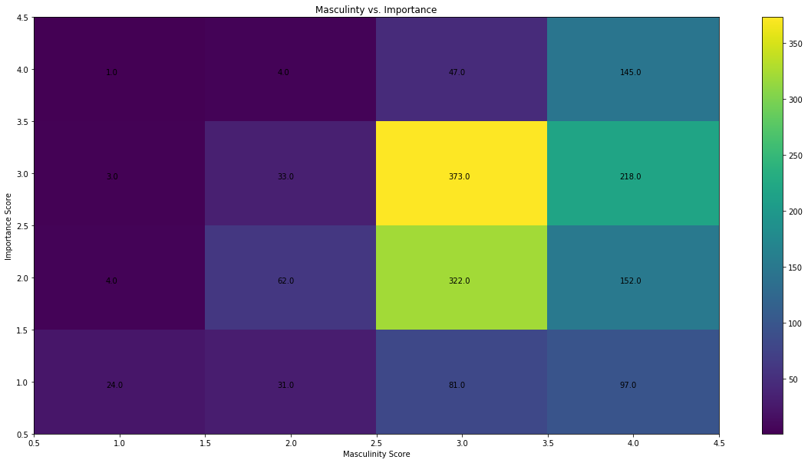


**Results:** This graph shows that high masculinity scores appear correlated with a high importance score, allowing us to conclude that importance of being seen as masculine is an important attribute to those who consider themselves masculine. 

#### Masculinity Vs. Importance Correlation

In order to find out the general correlation between masculinity and importance of masculinity, we computed the correlation coefficient utilizing pandas corr function. The result shows a positive score which indicates that the two attributes are positively correlated meaning that they are related. However, this score is not as high as we thought it would be from the histogram above, since the result was <.5, but correlation values range from -1 to +1. Therefore, we conclude that importance of masculinity somewhat affects how masculine men perceive themselves, but is not the strongest attribute of masculinity.


```python
mi_corr = hist_data[['q0001', 'q0002']].corr('pearson')

print('Masculinity/Importance Correllation = {:1.2f}'.format(mi_corr.loc['q0001', 'q0002']))
```

    Masculinity/Importance Correllation = 0.24


#### Pairwise correlation of answers in Question 7

To discover which actions that masculine men frequently (or infrequently) take and how they correllate to other actions, we wanted to run a statistical correlation analysis on pairs of actions reported in question 7. From this we can see group trends of actions and gain some insight into what typical men do often relative to other actions. Question 7 reads as follows:

> **7. How often would you say you do each of the following? *Select from: (Often; Sometimes; Rarely; Never, but open to it; Never, and not open to it)*** (RANDOMIZE)
> * Ask a friend for professional advice
> * Ask a friend for personal advice
> * Express physical affection towards male friends, like hugging, rubbing shoulders
> * Cry
> * Get in a physical fight with another person
> * Have sexual relations with women, including anything from kissing to sex
> * Have sexual relations with men, including anything from kissing to sex
> * Watch sports of any kind
> * Work out
> * See a therapist
> * Feel lonely or isolated

These values were returned in a dataframe so that it would be easy and neat to visualize and so we would be able to plot out this data to better see the correlations.


```python
q7_data = scrub_data[['q0007_0001', 'q0007_0002', 'q0007_0003', 'q0007_0004', 
                      'q0007_0005', 'q0007_0006', 'q0007_0007', 'q0007_0008', 
                      'q0007_0009', 'q0007_0010', 'q0007_0011']].dropna().astype(int)
q7_corr = q7_data.corr('pearson')

q7_corr
```


<div>
<style scoped>
    .dataframe tbody tr th:only-of-type {
        vertical-align: middle;
    }

    .dataframe tbody tr th {
        vertical-align: top;
    }

    .dataframe thead th {
        text-align: right;
    }
</style>
<table border="1" class="dataframe">
  <thead>
    <tr style="text-align: right;">
      <th></th>
      <th>q0007_0001</th>
      <th>q0007_0002</th>
      <th>q0007_0003</th>
      <th>q0007_0004</th>
      <th>q0007_0005</th>
      <th>q0007_0006</th>
      <th>q0007_0007</th>
      <th>q0007_0008</th>
      <th>q0007_0009</th>
      <th>q0007_0010</th>
      <th>q0007_0011</th>
    </tr>
  </thead>
  <tbody>
    <tr>
      <th>q0007_0001</th>
      <td>1.000000</td>
      <td>0.690267</td>
      <td>0.322235</td>
      <td>0.280567</td>
      <td>0.087429</td>
      <td>0.103299</td>
      <td>0.092498</td>
      <td>0.131216</td>
      <td>0.225550</td>
      <td>0.217229</td>
      <td>0.164769</td>
    </tr>
    <tr>
      <th>q0007_0002</th>
      <td>0.690267</td>
      <td>1.000000</td>
      <td>0.383926</td>
      <td>0.312377</td>
      <td>0.070802</td>
      <td>0.084555</td>
      <td>0.133620</td>
      <td>0.100669</td>
      <td>0.206604</td>
      <td>0.265998</td>
      <td>0.194277</td>
    </tr>
    <tr>
      <th>q0007_0003</th>
      <td>0.322235</td>
      <td>0.383926</td>
      <td>1.000000</td>
      <td>0.346979</td>
      <td>0.007363</td>
      <td>-0.059686</td>
      <td>0.285940</td>
      <td>0.009289</td>
      <td>0.131119</td>
      <td>0.223506</td>
      <td>0.128829</td>
    </tr>
    <tr>
      <th>q0007_0004</th>
      <td>0.280567</td>
      <td>0.312377</td>
      <td>0.346979</td>
      <td>1.000000</td>
      <td>0.038317</td>
      <td>-0.035428</td>
      <td>0.178914</td>
      <td>0.006136</td>
      <td>0.060209</td>
      <td>0.270849</td>
      <td>0.242495</td>
    </tr>
    <tr>
      <th>q0007_0005</th>
      <td>0.087429</td>
      <td>0.070802</td>
      <td>0.007363</td>
      <td>0.038317</td>
      <td>1.000000</td>
      <td>0.114237</td>
      <td>0.008492</td>
      <td>0.062825</td>
      <td>0.095035</td>
      <td>0.037495</td>
      <td>0.080281</td>
    </tr>
    <tr>
      <th>q0007_0006</th>
      <td>0.103299</td>
      <td>0.084555</td>
      <td>-0.059686</td>
      <td>-0.035428</td>
      <td>0.114237</td>
      <td>1.000000</td>
      <td>-0.420896</td>
      <td>0.241577</td>
      <td>0.213098</td>
      <td>-0.021627</td>
      <td>-0.100393</td>
    </tr>
    <tr>
      <th>q0007_0007</th>
      <td>0.092498</td>
      <td>0.133620</td>
      <td>0.285940</td>
      <td>0.178914</td>
      <td>0.008492</td>
      <td>-0.420896</td>
      <td>1.000000</td>
      <td>-0.202926</td>
      <td>-0.076485</td>
      <td>0.124381</td>
      <td>0.135594</td>
    </tr>
    <tr>
      <th>q0007_0008</th>
      <td>0.131216</td>
      <td>0.100669</td>
      <td>0.009289</td>
      <td>0.006136</td>
      <td>0.062825</td>
      <td>0.241577</td>
      <td>-0.202926</td>
      <td>1.000000</td>
      <td>0.258912</td>
      <td>-0.042129</td>
      <td>-0.017395</td>
    </tr>
    <tr>
      <th>q0007_0009</th>
      <td>0.225550</td>
      <td>0.206604</td>
      <td>0.131119</td>
      <td>0.060209</td>
      <td>0.095035</td>
      <td>0.213098</td>
      <td>-0.076485</td>
      <td>0.258912</td>
      <td>1.000000</td>
      <td>0.069122</td>
      <td>0.029556</td>
    </tr>
    <tr>
      <th>q0007_0010</th>
      <td>0.217229</td>
      <td>0.265998</td>
      <td>0.223506</td>
      <td>0.270849</td>
      <td>0.037495</td>
      <td>-0.021627</td>
      <td>0.124381</td>
      <td>-0.042129</td>
      <td>0.069122</td>
      <td>1.000000</td>
      <td>0.346332</td>
    </tr>
    <tr>
      <th>q0007_0011</th>
      <td>0.164769</td>
      <td>0.194277</td>
      <td>0.128829</td>
      <td>0.242495</td>
      <td>0.080281</td>
      <td>-0.100393</td>
      <td>0.135594</td>
      <td>-0.017395</td>
      <td>0.029556</td>
      <td>0.346332</td>
      <td>1.000000</td>
    </tr>
  </tbody>
</table>
</div>


**Results:** It is actually harder to gain insight from each question's correlation value from this dataframe than we had originally anticipated. Because of this, we decided to plot out all of the values to make it visually easier to detect trends in the data.

#### Correlation Heat Map

The answer - another heat map! We used the seaborn library, which allows for the creation of colorful plots from pandas dataframes. More information about seaborn can be found here - https://seaborn.pydata.org/. Seaborn has a heatmap function, which allowed us to easily use the dataframe above to show which questions are more correlated with each other. The lighter colors correspond to greater correlation values, while the darker colors indicate less of a correlation. The black color corresponds to a negative correlation, which means that these two attributes are not at all related.


```python
import seaborn as sns
fig, ax = plot.subplots(figsize = (20, 10))
sns.heatmap(q7_corr.T, ax = ax)
plot.show()
```


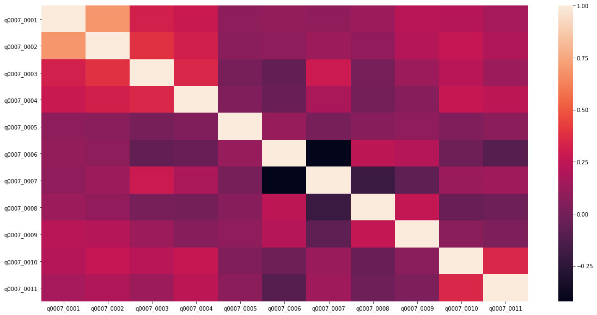


**Results:** From this heat map, we can visually detect some interesting positive and negative correlations between actions. 

For the positive, well start with the upper left bright patch between options 1 through 4. The strongest of positive correlations is between options 1 and 2 which regard seeking professional and personal advice from friends with a correlation of 0.69. The rest of that block has relatively high correlations comapared to the rest of the heat map however they have scores around 0.3 to 0.4 which are incredibly significant. 

Other positively correlated actions include those in option pairs (3, 7), (4, 10), (4, 11), and (10, 11). The first highlights a correleation between those who opt for men as sexual partners as asked in option 7 and the demonstration of lighter physical affection towards male friends as described in option 3. The latter 3 pairs highlight a correlation between actions such as crying, seeing a therapist, and feeling lonely or isolated, which demonstrate emotional vulnerability.

Another area that pops out of the data is the pairwise correlations between options 6, 8, and 9, regarding interest in women, profesional sports, and physical fitness.

For the negative, unsurprisingly the correlation between the frequency of heterosexual and homosexual activity is starkly negative at -0.42, but we also seem to find that watching sports and and working out is also negatively correltated to homosexual activity, albeit to a lesser degree.

In regards to those who have more sex with women, there is a slight negative correlation with emotional vulnerability as discussed earlier although not significant enough to draw any sort of conclusion as they range from -0.1 to 0. This may be due to a lack of data among homosexual men which may get lost in the overwhelming majority of heterosexual men surveyed.

#### Correlation between reported masculinity and Question 7 actions

To conclusively determine which actions listed in question are more masculine than others, we calculated the correlation between each of part of question 7 with question 1. 


```python
q1q7_data = scrub_data[['q0001', 'q0007_0001', 'q0007_0002', 'q0007_0003', 
                        'q0007_0004', 'q0007_0005', 'q0007_0006', 'q0007_0007', 
                        'q0007_0008', 'q0007_0009', 'q0007_0010', 'q0007_0011']].dropna().astype(int)
q1q7_corr = q1q7_data.corr('pearson')

q1q7_corr[['q0001']].sort_values('q0001', ascending = False)
```


<div>
<style scoped>
    .dataframe tbody tr th:only-of-type {
        vertical-align: middle;
    }

    .dataframe tbody tr th {
        vertical-align: top;
    }

    .dataframe thead th {
        text-align: right;
    }
</style>
<table border="1" class="dataframe">
  <thead>
    <tr style="text-align: right;">
      <th></th>
      <th>q0001</th>
    </tr>
  </thead>
  <tbody>
    <tr>
      <th>q0001</th>
      <td>1.000000</td>
    </tr>
    <tr>
      <th>q0007_0006</th>
      <td>0.264966</td>
    </tr>
    <tr>
      <th>q0007_0008</th>
      <td>0.183257</td>
    </tr>
    <tr>
      <th>q0007_0009</th>
      <td>0.133996</td>
    </tr>
    <tr>
      <th>q0007_0005</th>
      <td>0.100738</td>
    </tr>
    <tr>
      <th>q0007_0001</th>
      <td>0.085096</td>
    </tr>
    <tr>
      <th>q0007_0002</th>
      <td>0.051979</td>
    </tr>
    <tr>
      <th>q0007_0003</th>
      <td>0.024599</td>
    </tr>
    <tr>
      <th>q0007_0004</th>
      <td>-0.059992</td>
    </tr>
    <tr>
      <th>q0007_0010</th>
      <td>-0.086184</td>
    </tr>
    <tr>
      <th>q0007_0007</th>
      <td>-0.138682</td>
    </tr>
    <tr>
      <th>q0007_0011</th>
      <td>-0.173455</td>
    </tr>
  </tbody>
</table>
</div>


**Results:** After sorting the correlation values, we can see that most of our correlation values are not very significant however relative to eachother we can interpret some patterns. 

Options 6, 8, and 9 top the list with those regarding sex with women, watching sports, and working out. Since from our previous pairwise analysis between these, we can intuitively suspect that these encompass the most masculine traits. 

Options 7 and 11 tail our list as our least masculine traits, regarding sex with men and feeling lonely and isolated. The former of these may be due to a lack of data from homosexual men conflated with us not taking sexuality into account.

### **Machine Learning Analyses**

To try to discover deeper trends amongst how masculinity interacts with actions, attitudes, and dating practices, we wanted to do a number of machine learning analyses on questions 7, 8, and 20. For each model, we do a repeated 10-fold cross validation and report the mean and median accuracy (or score in the linear regression case) with a 95% confidence bound as well as plot residuals to visually see how closely our model is predicting masculinity. 

Before we do this, we need to clean up our data to remove rows that contain missing values and cast our columns as the type that they are instead of object types. We also do not include the last option of questions 8 and 20 as they are 'None of the above' which is encoded by all False values in the previous options.


```python
import numpy as np

def skew(array):
    return 3 * (np.mean(array) - np.median(array)) / np.std(array)

scrub_data = scrub_data[['q0001', 
                         'q0007_0001', 'q0007_0002', 'q0007_0003', 'q0007_0004', 
                         'q0007_0005', 'q0007_0006', 'q0007_0007', 'q0007_0008', 
                         'q0007_0009', 'q0007_0010', 'q0007_0011',
                         'q0008_0001', 'q0008_0002', 'q0008_0003', 'q0008_0004', 
                         'q0008_0005', 'q0008_0006', 'q0008_0007', 'q0008_0008', 
                         'q0008_0009', 'q0008_0010', 'q0008_0011',
                         'q0020_0001', 'q0020_0002', 'q0020_0003', 'q0020_0004', 
                         'q0020_0005', 'q0020_0006']].dropna()
scrub_int = scrub_data[['q0001', 
                        'q0007_0001', 'q0007_0002', 'q0007_0003', 'q0007_0004', 
                        'q0007_0005', 'q0007_0006', 'q0007_0007', 'q0007_0008', 
                        'q0007_0009', 'q0007_0010', 'q0007_0011']].astype(int)
scrub_bool = scrub_data[['q0008_0001', 'q0008_0002', 'q0008_0003', 'q0008_0004', 
                         'q0008_0005', 'q0008_0006', 'q0008_0007', 'q0008_0008', 
                         'q0008_0009', 'q0008_0010', 'q0008_0011',
                         'q0020_0001', 'q0020_0002', 'q0020_0003', 'q0020_0004', 
                         'q0020_0005', 'q0020_0006']].astype(bool)
scrub_data = scrub_int.join(scrub_bool)
```

### Questions 7, 8, and 20 Analyses

For our all encompassing models, we decided to look at a Decision Tree model and a Neural Network/MLP Classifier model. We could not do a regression model as the data type of question 7 differs from that of question 8 and 20. We begin by preparing or 10-fold cross validation and splitting our data into our train and test sets for plotting later. For reference, here are questions 7, 8, and 20 as they read:

> **7. How often would you say you do each of the following? *Select from: (Often; Sometimes; Rarely; Never, but open to it; Never, and not open to it)*** (RANDOMIZE) 
> * Ask a friend for professional advice
> * Ask a friend for personal advice
> * Express physical affection towards male friends, like hugging, rubbing shoulders
> * Cry
> * Get in a physical fight with another person
> * Have sexual relations with women, including anything from kissing to sex
> * Have sexual relations with men, including anything from kissing to sex
> * Watch sports of any kind
> * Work out
> * See a therapist
> * Feel lonely or isolated

> **8. Which of the following do you worry about on a daily or near daily basis? (Select all that apply)** (RANDOMIZE) 
> * Your height
> * Your weight
> * Your hair of hairline
> * Your physique
> * Appearance of your genatalia
> * Your clothing or style
> * Sexual performance or amount of sex
> * Your mental health
> * Your physical health
> * Your finances, including your future income, assets, or debt
> * Your ability to provide to your family, current or anticipated

> **20. When you want to be physically intimate with someone, how do you gauge their interest? (Select all that apply)** (RANDOMIZE) 
> * Read their physical body language to see if they are interested.
> * Ask for verbal confirmation of consent
> * Make a physical move to see how they react
> * Every situation is different
> * It isn't always clear how to gauge someone's interest


```python
from sklearn.model_selection import RepeatedKFold, cross_val_score

x = scrub_data[['q0007_0001', 'q0007_0002', 'q0007_0003', 'q0007_0004', 
                'q0007_0005', 'q0007_0006', 'q0007_0007', 'q0007_0008', 
                'q0007_0009', 'q0007_0010', 'q0007_0011',
                'q0008_0001', 'q0008_0002', 'q0008_0003', 'q0008_0004', 
                'q0008_0005', 'q0008_0006', 'q0008_0007', 'q0008_0008', 
                'q0008_0009', 'q0008_0010', 'q0008_0011',
                'q0020_0001', 'q0020_0002', 'q0020_0003', 'q0020_0004', 
                'q0020_0005', 'q0020_0006']]
y = scrub_data[['q0001']]
x = np.array([list(i) for i in x.values])
y = np.array([list(i) for i in y.values])
kf = RepeatedKFold(n_splits = 10, n_repeats = 5)
kf.get_n_splits(x)
for train_index, test_index in kf.split(x):
    x_train, x_test = x[train_index], x[test_index]
    y_train, y_test = y[train_index], y[test_index]
```

#### Decision Tree
The first model we want to evaluate is the Decision Tree for all three of these questions as our input and reported masculinity as our output.


```python
from sklearn import tree

clf = tree.DecisionTreeClassifier()
clf.fit(x_train, y_train)
scores = cross_val_score(clf, x_test, y_test, cv = kf)

print('Mean Accuracy   = {0:2.1f}% +- {2:2.1f}%\nMedian Accuracy = {1:2.1f}% +- {2:2.1f}%'.format(
    np.mean(scores) * 100, np.median(scores) * 100, np.std(scores) * 200))

residuals = np.array([clf.predict([i]) for i in x_test]).reshape(-1, 1) - np.array(y_test)
plot.figure(figsize = (20, 10))
plot.hist(residuals.flatten(), bins = 9, range = (-4.5, 4.5))
plot.text(3.5, 50, 'Residual Mean = {:1.3f}\nResidual Spread = {:1.3f}\nResidual Skew = {:1.3f}'.format(
    residuals.mean(), residuals.std(), skew(residuals)))
plot.xlabel('Masculinity Prediction Error')
plot.ylabel('Frequency')
plot.title('Decision Tree Error Distribution (Q7, Q8, Q20)')
plot.show()
```

    Mean Accuracy   = 44.7% +- 23.7%
    Median Accuracy = 42.9% +- 23.7%


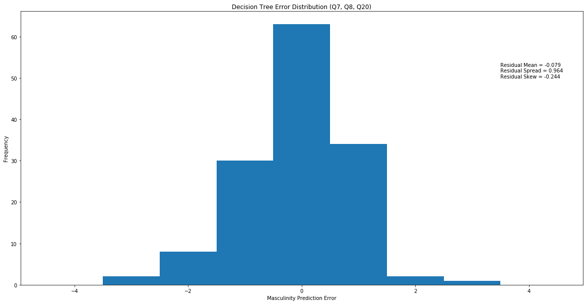


**Results:** We see that our accuracy is just below 50% with a rather wide confidence bound; however, our model appears to work reasonably well considering a vast majority of our predictions are within 1 level of masculity from the reported value which, given our early distribution of answers to question 1, are likely to be the differences between 'Somewhat masculine' and 'Very masculine'. This model's performance varies a lot.

#### MLP Classifier (Neural Network)

Out of curiosity, we wanted to see what the performance of a MLP classifier would be, even though we did not cover it extensively during the semester. For this neural network, we decide to use a network with 3 dense layers of 100 perceptrons each, stochastic gradient descent back propogation, and 5000 epochs. 


```python
from sklearn import neural_network

nn = neural_network.MLPClassifier(hidden_layer_sizes = (100, 5), solver = 'sgd', max_iter = 5000)
nn.fit(x_train, y_train.reshape(-1))
scores = cross_val_score(nn, x_test, y_test.reshape(-1), cv = kf)

print('Mean Accuracy   = {0:2.1f}% +- {2:2.1f}%\nMedian Accuracy = {1:2.1f}% +- {2:2.1f}%'.format(
    np.mean(scores) * 100, np.median(scores) * 100, np.std(scores) * 200))

residuals = np.array([nn.predict([i]) for i in x_test]).reshape(-1, 1) - np.array(y_test)
plot.figure(figsize = (20, 10))
plot.hist(residuals.flatten(), bins = 9, range = (-4.5, 4.5))
plot.text(3.5, 50, 'Residual Mean = {:1.3f}\nResidual Spread = {:1.3f}\nResidual Skew = {:1.3f}'.format(
    residuals.mean(), residuals.std(), skew(residuals)))
plot.xlabel('Masculinity Prediction Error')
plot.ylabel('Frequency')
plot.title('MLP Classifier Error Distribution (Q7, Q8, Q20)')
plot.show()
```

    Mean Accuracy   = 48.6% +- 28.9%
    Median Accuracy = 50.0% +- 28.9%


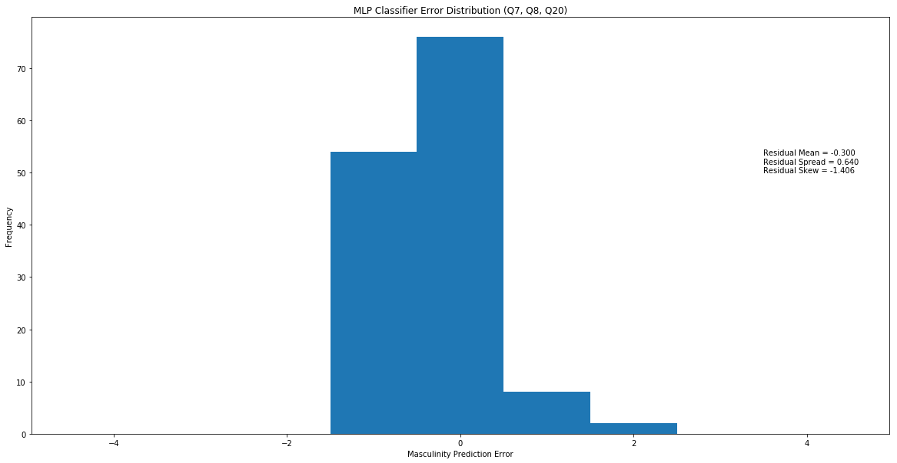


**Results:** It takes several seconds to fit the model and when performing 10-fold cross validation 5 times, the delay is significant. We will see later in the individual analysis of questions that we can achieve similar accuracies in much less time with regression.

### Question 7 Analyses

For our remaining analyses, we will continue to use a Decision Tree but we will opt for Regression over MLP Classification since we are working input vectors of a homogneous type and it is a less expensive computation. As before, we begin by preparing our 10-fold cross validation.


```python
from sklearn import linear_model

x = scrub_data[['q0007_0001', 'q0007_0002', 'q0007_0003', 'q0007_0004', 
                'q0007_0005', 'q0007_0006', 'q0007_0007', 'q0007_0008', 
                'q0007_0009', 'q0007_0010', 'q0007_0011']]
y = scrub_data[['q0001']]
x = np.array([list(i) for i in x.values])
y = np.array([list(i) for i in y.values])
kf = RepeatedKFold(n_splits = 10, n_repeats = 5)
kf.get_n_splits(x)
for train_index, test_index in kf.split(x):
    x_train, x_test = x[train_index], x[test_index]
    y_train, y_test = y[train_index], y[test_index]
```

#### Linear Regression

Our first model for question 7 will be a Linear Regressor with an r-squared scoring method. Because of this scoring method, we will not be reporting our scores as accuracies since they can negative and r^2 is not necessarily the the strongest predictor of fit. Instead, we will be taking the 0+-0.5 bin value from the histogram to evaluate an accuracy comparable to our other models.


```python
reg = linear_model.LinearRegression()
reg.fit(x_train, y_train)
scores = cross_val_score(reg, x_test, y_test, cv = kf, scoring = 'r2')

print('Mean Score   = {0:1.3f} +- {2:1.3f}\nMedian Score = {1:1.3f} +- {2:1.3f}'.format(
    np.mean(scores), np.median(scores), np.std(scores)))
print('Coefficients and Intercept: ', reg.coef_, reg.intercept_)

residuals = np.array([reg.predict([i]) for i in x_test]).reshape(-1, 1) - np.array(y_test)
plot.figure(figsize = (20, 10))
hist_data, hist_bins, _ = plot.hist(residuals.flatten(), bins = 9, range = (-4.25, 4.25))
plot.text(3, 50, 'Residual Mean = {:1.3f}\nResidual Spread = {:1.3f}\nResidual Skew = {:1.3f}'.format(
    residuals.mean(), residuals.std(), skew(residuals)))
plot.xlabel('Masculinity Prediction Error')
plot.ylabel('Frequency')
plot.title('Linear Regressor Error Distribution (Q7)')
plot.show()
print('+-0.5-bin Accuracy = {:2.1f}%'.format(100*hist_data[4]/sum(hist_data)))
```

    Mean Score   = -0.038 +- 0.260
    Median Score = -0.060 +- 0.260
    Coefficients and Intercept:  [[ 0.02323185  0.02393164  0.03178118 -0.03678641  0.05093224  0.0987841
      -0.0185614   0.06154105  0.02937443 -0.02461819 -0.08444627]] [2.64612654]


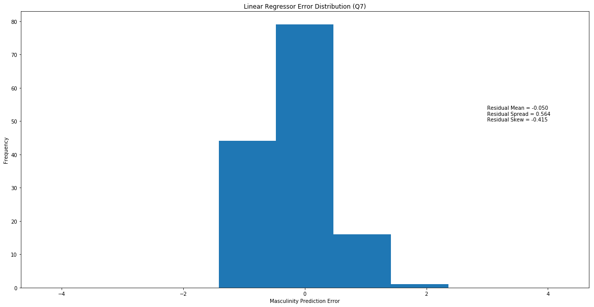


    +-0.5-bin Accuracy = 56.4%


**Results:** This model, from its r-squared score, seems not to predict masculinity very well. However, we note that the zero-bin accuracy is about 50%, which suggests that this works about as well as the MLP Classifier from early but is much faster.

Another thing to note is the intercept value of around 2.5. This indicates that most of the fitting is being done to the vast majority of those who responded feeling 'Somewhat masculine' or 'Very masculine'. We also note that the spread (or standard deviation) of our residuals is tighter than others which suggest that this model is a better predictor than other models.

Given all of this, our r-squared scores may indicated that a non-linear model with interaction terms may be a better predictor than this, however that analysis will not be done in this project.

#### Decision Tree

We will use a Decison Tree classifier like we did in the previous part but with the data from question 7 only.


```python
clf = tree.DecisionTreeClassifier()
clf.fit(x_train, y_train)
scores = cross_val_score(clf, x_test, y_test, cv = kf)

print('Mean Accuracy   = {0:2.1f}% +- {2:2.1f}%\nMedian Accuracy = {1:2.1f}% +- {2:2.1f}%'.format(
    np.mean(scores) * 100, np.median(scores) * 100, np.std(scores) * 200))

residuals = np.array([clf.predict([i]) for i in x_test]).reshape(-1, 1) - np.array(y_test)
plot.figure(figsize = (20, 10))
plot.hist(residuals.flatten(), bins = 9, range = (-4.5, 4.5))
plot.text(3.5, 50, 'Residual Mean = {:1.3f}\nResidual Spread = {:1.3f}\nResidual Skew = {:1.3f}'.format(
    residuals.mean(), residuals.std(), skew(residuals)))
plot.xlabel('Masculinity Prediction Error')
plot.ylabel('Frequency')
plot.title('Decision Tree Error Distribution (Q7)')
plot.show()
```

    Mean Accuracy   = 48.4% +- 29.9%
    Median Accuracy = 50.0% +- 29.9%


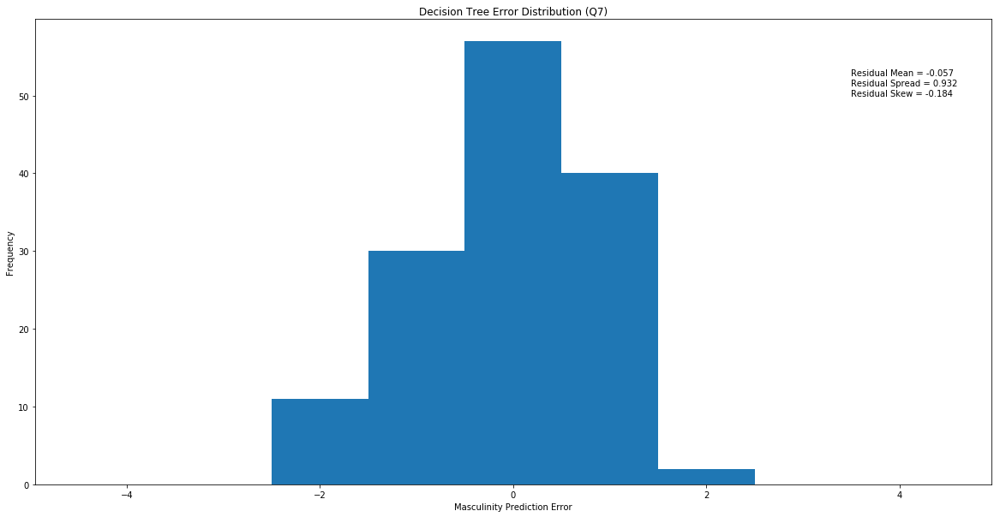


**Results:** The Decision Tree did not work as well on this data set at an accuracy of about 45%. This model also ranges a lot in its performance.

### Question 8 Analyses

Question 8 surveys mens' self-image. Intuitively, we would expect this to be one of the strongest predictors of masculinity since we have seen from questions 1 and 2 that masculinity is positively correlted with importance of being seen as masculine; however, this ends up being a weaker individual predictor of masculinity for both models that we evaluate.

As always, we begin by preparing our 10-fold cross validation.


```python
x = scrub_data[['q0008_0001', 'q0008_0002', 'q0008_0003', 'q0008_0004', 
                'q0008_0005', 'q0008_0006', 'q0008_0007', 'q0008_0008', 
                'q0008_0009', 'q0008_0010', 'q0008_0011']]
y = scrub_data[['q0001']]
x = np.array([list(i) for i in x.values])
y = np.array([list(i) for i in y.values])
kf = RepeatedKFold(n_splits = 10, n_repeats = 5)
kf.get_n_splits(x)
for train_index, test_index in kf.split(x):
    x_train, x_test = x[train_index], x[test_index]
    y_train, y_test = y[train_index], y[test_index]
```

#### Logistic Regression

Since we have boolean values for our question 8 options, we will be using a Logistic Regressor to predict masculinity for our first model.


```python
reg = linear_model.LogisticRegression()
reg.fit(x_train, np.ravel(y_train))
scores = cross_val_score(reg, x_test, np.ravel(y_test), cv = kf)

print('Mean Accuracy   = {0:2.1f}% +- {2:2.1f}%\nMedian Accuracy = {1:2.1f}% +- {2:2.1f}%'.format(
    np.mean(scores) * 100, np.median(scores) * 100, np.std(scores) * 200))
print('Coefficients and Intercept: ', reg.coef_, reg.intercept_)

residuals = np.array([reg.predict([i]) for i in x_test]).reshape(-1, 1) - np.array(y_test)
plot.figure(figsize = (20, 10))
plot.hist(residuals.flatten(), bins = 9, range = (-4.5, 4.5))
plot.text(3.5, 60, 'Residual Mean = {:1.3f}\nResidual Spread = {:1.3f}\nResidual Skew = {:1.3f}'.format(
    residuals.mean(), residuals.std(), skew(residuals)))
plot.xlabel('Masculinity Prediction Error')
plot.ylabel('Frequency')
plot.title('Logistic Regressor Error Distribution (Q8)')
plot.show()
```

    Mean Accuracy   = 46.9% +- 24.3%
    Median Accuracy = 50.0% +- 24.3%
    Coefficients and Intercept:  [[ 0.07452438 -1.07156782  1.24159581 -0.46675897  0.06954374  0.41421456
       0.71627778  0.26827463 -0.64658608  0.37709752 -0.95800668]
     [ 0.19175115 -0.08314804  0.15461142 -0.00441863  0.44288016  0.13339977
       0.49883154  0.47791416 -0.17425859 -0.30935831 -0.02132269]
     [-0.23096856  0.20796192 -0.22738878  0.08454509 -0.02416507  0.15754157
      -0.00315697  0.30444751  0.26222751  0.06441843 -0.23071881]
     [ 0.1646336  -0.1300842   0.01470487 -0.04280255 -0.20382748 -0.29818677
      -0.27485667 -0.55846722 -0.18568008 -0.04904507  0.34883669]] [-3.61011802 -2.4864294  -0.21898217 -0.14134116]


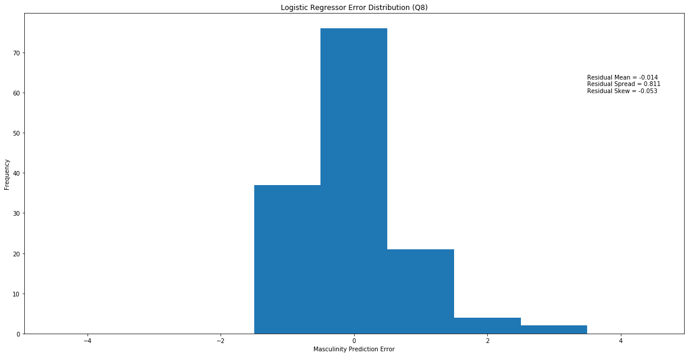


**Results:** This model performed better than the Decision Tree model for other questions. This model does happen to have some large over predictions which, given the very discrete nature of the output range, indicates the weakness of this predictor. This models performance varies a lot as well.

#### Decision Tree

Next we will run a Decision Tree classifier on our question 8 inputs.


```python
clf = tree.DecisionTreeClassifier()
clf.fit(x_train, y_train)
scores = cross_val_score(clf, x_test, y_test, cv = kf)

print('Mean Accuracy   = {0:2.1f}% +- {2:2.1f}%\nMedian Accuracy = {1:2.1f}% +- {2:2.1f}%'.format(
    np.mean(scores) * 100, np.median(scores) * 100, np.std(scores) * 200))

residuals = np.array([clf.predict([i]) for i in x_test]).reshape(-1, 1) - np.array(y_test)
plot.figure(figsize = (20, 10))
plot.hist(residuals.flatten(), bins = 9, range = (-4.5, 4.5))
plot.text(3.5, 60, 'Residual Mean = {:1.3f}\nResidual Spread = {:1.3f}\nResidual Skew = {:1.3f}'.format(
    residuals.mean(), residuals.std(), skew(residuals)))
plot.xlabel('Masculinity Prediction Error')
plot.ylabel('Frequency')
plot.title('Decision Tree Error Distribution (Q8)')
plot.show()
```

    Mean Accuracy   = 43.3% +- 23.3%
    Median Accuracy = 42.9% +- 23.3%


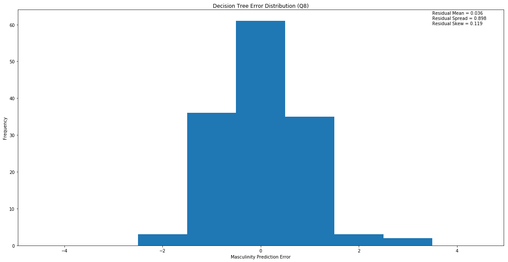


**Results:** Accuracies around 35% show that this model is the weakest among all of them, even across questions. This, as well as the results from the previous model for question 8, indicate that self-image is likely not a good predictor of masculinity against our intuition.

### Question 20 Analyses

Question 20 regards how men approach intimate relations. We figured that this would also be a strong indicator of masculinity as the strongest correlation between an action and self reported masculinity was how often men had sex with women, granted in this predominantely heterosexual dataset.

We will first prepare our 10-fold cross validation for our final individual question analysis.


```python
x = scrub_data[['q0020_0001', 'q0020_0002', 'q0020_0003', 'q0020_0004', 
                'q0020_0005', 'q0020_0006']]
y = scrub_data[['q0001']]
x = np.array([list(i) for i in x.values])
y = np.array([list(i) for i in y.values])
kf = RepeatedKFold(n_splits = 10, n_repeats = 5)
kf.get_n_splits(x)
for train_index, test_index in kf.split(x):
    x_train, x_test = x[train_index], x[test_index]
    y_train, y_test = y[train_index], y[test_index]   
```

#### Logistic Regression

Like the previous question, we will run a Logistic Regressor first.


```python
reg = linear_model.LogisticRegression()
reg.fit(x_train, np.ravel(y_train))
scores = cross_val_score(reg, x_test, np.ravel(y_test), cv = kf)

print('Mean Accuracy   = {0:2.1f}% +- {2:2.1f}%\nMedian Accuracy = {1:2.1f}% +- {2:2.1f}%'.format(
    np.mean(scores) * 100, np.median(scores) * 100, np.std(scores) * 200))
print('Coefficients and Intercept: ', reg.coef_, reg.intercept_)

residuals = np.array([reg.predict([i]) for i in x_test]).reshape(-1, 1) - np.array(y_test)
plot.figure(figsize = (20, 10))
plot.hist(residuals.flatten(), bins = 9, range = (-4.5, 4.5))
plot.text(3.5, 60, 'Residual Mean = {:1.3f}\nResidual Spread = {:1.3f}\nResidual Skew = {:1.3f}'.format(
    residuals.mean(), residuals.std(), skew(residuals)))
plot.xlabel('Masculinity Prediction Error')
plot.ylabel('Frequency')
plot.title('Logistic Regressor Error Distribution (Q20)')
plot.show()
```

    Mean Accuracy   = 52.4% +- 22.4%
    Median Accuracy = 50.0% +- 22.4%
    Coefficients and Intercept:  [[-0.78972333 -0.97624967  0.00952026 -1.0121228   0.47541289 -0.17839305]
     [-0.07222591  0.08996948 -0.05443601 -0.7436089   0.6214534   0.03390766]
     [-0.04455699  0.05709605 -0.27450338 -0.00651972  0.1619721  -0.25266106]
     [ 0.13286214 -0.02481714  0.29189296  0.33691329 -0.49875561  0.25813949]] [-3.10997994 -2.19635021  0.11423363 -0.67784766]


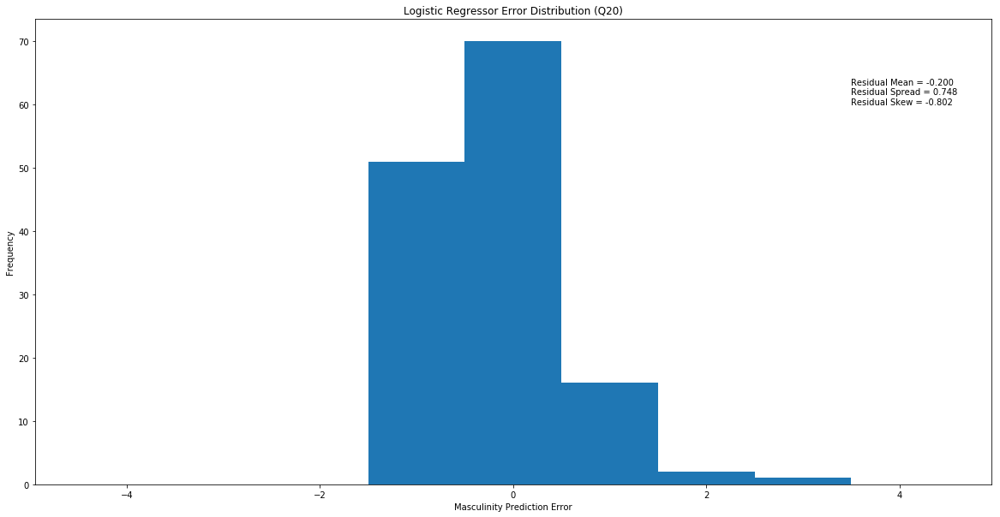


**Results:** This model performs about as well as our other good models as about 50%. Also the spread of residuals indicate that this is a reasonably good predictor, although the skew indicates that it underpredicts reported masculinity.

#### Decision Tree

Finally, we will run a Decision Tree classifier on question 20 inputs.


```python
clf = tree.DecisionTreeClassifier()
clf.fit(x_train, y_train)
scores = cross_val_score(clf, x_test, y_test, cv = kf)

print('Mean Accuracy   = {0:2.1f}% +- {2:2.1f}%\nMedian Accuracy = {1:2.1f}% +- {2:2.1f}%'.format(
    np.mean(scores) * 100, np.median(scores) * 100, np.std(scores) * 200))

residuals = np.array([clf.predict([i]) for i in x_test]).reshape(-1, 1) - np.array(y_test)
plot.figure(figsize = (20, 10))
plot.hist(residuals.flatten(), bins = 9, range = (-4.5, 4.5))
plot.text(3.5, 60, 'Residual Mean = {:1.3f}\nResidual Spread = {:1.3f}\nResidual Skew = {:1.3f}'.format(
    residuals.mean(), residuals.std(), skew(residuals)))
plot.xlabel('Masculinity Prediction Error')
plot.ylabel('Frequency')
plot.title('Decision Tree Error Distribution (Q20)')
plot.show()
```

    Mean Accuracy   = 47.3% +- 25.5%
    Median Accuracy = 42.9% +- 25.5%


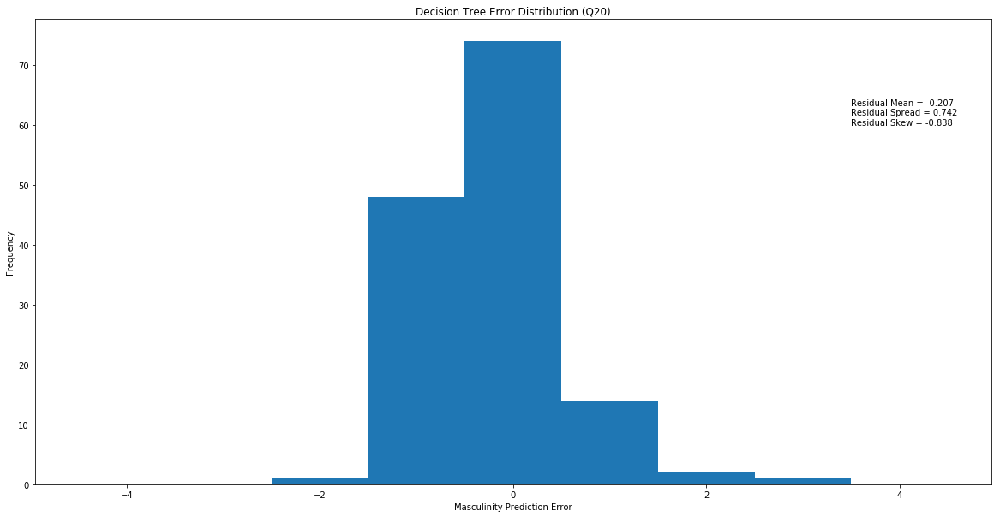


**Results:** This model predicts at just below 50%, similar to the other good Decision Tree classifier. This model and the previous model indicate that mens' approach to intimate relations is a relatively strong indicator of masculinity. This model's performance varies a lot as well.

### **Conclusion**

Our analyses found many interesting correlations and the models we trained made seemingly informed predictions regarding masculinity, albeit not the strongest or most accurate. This limitation on our models is often seen when trying to predict human behavior in psychological feilds, specifically in the r-squared values measured for our Linear Regression model ([Regression Analysis: How Do I Interpret R-squared and Assess the Goodness-of-Fit?](http://blog.minitab.com/blog/adventures-in-statistics-2/regression-analysis-how-do-i-interpret-r-squared-and-assess-the-goodness-of-fit)).

Among the actions in question 7, we found that those men who more often had worked out, watched sports, and had sex with women tended to feel more masculine. Those who less often felt or expressed emotional vulnerabilities, such as crying, feeling lonely or isolated, or seeing a therapist tended to also feel more masculine. Other actions seemed to be neutral in regards to how masculine those actions are percived, such as seeking advice from friends.

Among our predictions models, we found that Decision Trees overall performed worse compared to MLP Classifiers and Regressors. This went against our initial intuition as we were expecting a classification, but realized that our outputs and inputs scaled well to regression on an individual question analysis basis. For multi-question analysis, regression proved much more logistically challenging with heterogenous data types, thus we tested a neural network. Most of our model performance measures varied quite a bit, thus why we opted for repeated K-fold cross validation. However, we found that regression tended to be a bit more robust thus slightly aiding our prediction confidence.

Although we did not explore the effects of the #MeToo movement on attitudes toward masculinity among men, we were able to confidently identify traits that are considered masculine and explore deeper trends regarding emotional vulnerability and potential stigma surrounding it. It is safe to say more work can be done with this dataset beyond the scope of what we covered here.
